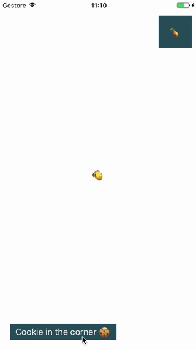
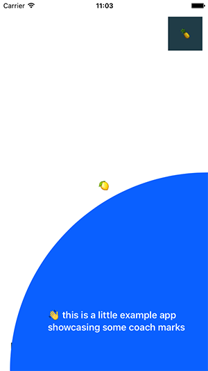

# CoachMarks

CoachMarks is a component, inspired by Material Design [Feature Discovery](https://material.io/guidelines/growth-communications/feature-discovery.html#feature-discovery-design) guidelines, that can be used in the onboarding process of iOS applications to focus the user attention on parts of the UI.




## Getting started

CoachMarks supports iOS 8+ and is available for installation using Carthage.

### [Carthage](https://github.com/Carthage/Carthage/#readme)

Just add CoachMarks to your `Cartfile`:


```
github "pNre/CoachMarks" ~> 1.0
```

## Usage

Please refer to the example project for usage examples.
